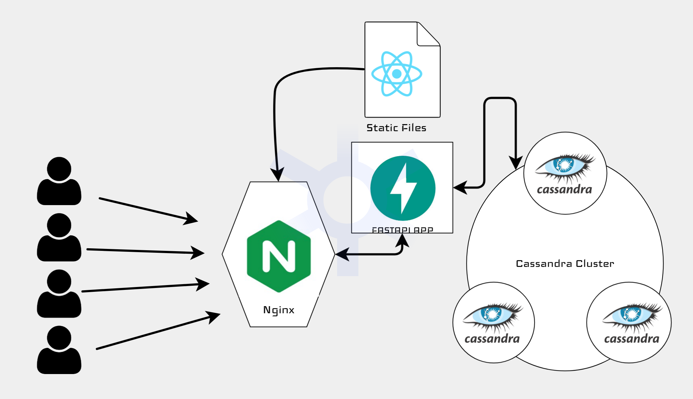

# 小 URL

[](https://github.com/Cosmicoppai/chi_url/network)
[](https://github.com/Cosmicoppai/chi_url/stargazers)
[](https://github.com/Cosmicoppai/chi_url/issues)
[](./LICENSE)

## About

 An URL Shortener developed using FASTAPI, Cassandra and React and deployed using containers on cloud.

- Easy to Scale
- Highly available
- Provide stats
- ... etc
  
## Simple Architecture


## Tech Stack
> ### Backend
> * FASTAPI
> ### Front-End
> * REACT
> ### Database
> * Cassandra
> ### Load Balancer and Reverse Proxy
> * Nginx
> ### Cloud Platform
> * AWS
> ### Container Tool
> * Docker


## SetUp and Installation

Clone the repository
```
git clone https://github.com/Cosmicoppai/chi_url
```
Create a virtual environment
```
virtualenv venv -p python3
```
Install the dependencies
```
pip install -r local/requirements.txt
```
add the key-value pairs in local/.env

```
cd local

docker-compose up
```
App should be running on [localhost](localhost)

## TO DO

- Set up a Caching layer like Redis to reduce the read time

## License
[MIT](http://opensource.org/licenses/MIT) © [CosmicOppai](https://github.com/cosmicoppai)
